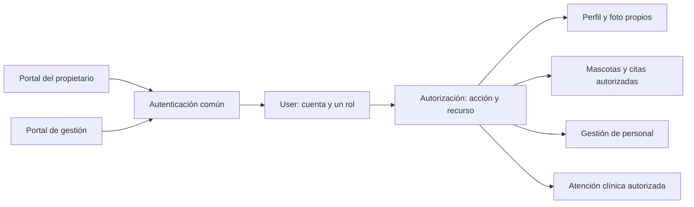

# GrownupsVet: usuarios, roles y foto de perfil

Fecha inicial: 6 de septiembre de 2026. Actualizado el 10 de septiembre con la implementación de perfil, foto, desactivación, revocación y comprobación dinámica de cuenta. Base de diseño y evidencia para registro, acceso y perfil. Se contrastaron el código local y las historias de Jira citadas aquí.

## Decisiones confirmadas y estado actual

- Esteban confirmó **un solo rol por cuenta** para la primera versión.
- El modelo existente `User` centraliza UUID, correo, hash de contraseña, rol y estado activo. `UserRole` y la migración `V1__create_users.sql` contienen `OWNER`, `VETERINARIAN` y `ADMINISTRATOR`.
- Las historias de Jira distribuyen las funciones entre propietario, veterinario y administrador. El registro público crea propietarios; no permite autoconcederse roles profesionales.
- El acceso común está implementado con credenciales de `User` y JWT RS256 de 24 horas. El propietario recibe cinco autoridades de perfil propio; veterinario y administrador reciben las dos autoridades de foto propia aplicables en este incremento.
- La foto de perfil sí forma parte de la primera versión. Es opcional, se almacena procesada en PostgreSQL y cada uno de los tres roles puede gestionar solamente su propia foto.
- Solo el propietario consulta su perfil personal, modifica su teléfono y desactiva su propia cuenta. Los demás datos personales del registro no tienen edición por el propietario en esta versión. Cambio y recuperación de contraseña pertenecen a autenticación.
- El administrador gestionará el perfil profesional del veterinario mediante operaciones posteriores. Permitir que el veterinario cambie su foto no le permite editar sus datos profesionales. Administradores y veterinarios no pueden desactivar su propia cuenta en este alcance.

## Responsabilidades de los tres roles

| Rol | Responsabilidad prevista en el backlog | Límite de acceso |
|---|---|---|
| `OWNER` — Propietario | Su perfil, sus mascotas, solicitudes de cita y consulta de información clínica publicada de sus mascotas. | La autorización comprueba la propiedad del recurso. No puede acceder a perfiles o mascotas ajenos, administrar personal ni modificar información clínica. |
| `VETERINARIAN` — Veterinario | Atención autorizada, registros clínicos, fórmulas y controles asociados. | Debe existir autorización sobre la atención o historia concreta. El alcance de lectura de antecedentes y agenda se concretará con sus contratos. Este rol no administra cuentas o roles. |
| `ADMINISTRATOR` — Administrador | Habilitar/desactivar personal autorizado, gestionar disponibilidad y confirmar solicitudes de cita. | No puede modificar información clínica. Su acceso de lectura clínica todavía debe definirse; el nombre del rol no concede acceso ilimitado. |

Evidencia actual: [registro y perfil, SCRUM-6](https://uqvirtual-team-yavszk8l.atlassian.net/browse/SCRUM-6), [personal, SCRUM-10](https://uqvirtual-team-yavszk8l.atlassian.net/browse/SCRUM-10), [disponibilidad, SCRUM-11](https://uqvirtual-team-yavszk8l.atlassian.net/browse/SCRUM-11), [solicitud y confirmación, SCRUM-12](https://uqvirtual-team-yavszk8l.atlassian.net/browse/SCRUM-12), [atención clínica, SCRUM-14](https://uqvirtual-team-yavszk8l.atlassian.net/browse/SCRUM-14) y [fórmula, SCRUM-16](https://uqvirtual-team-yavszk8l.atlassian.net/browse/SCRUM-16). El alcance de consulta del propietario también se recoge en P10 del backlog general del proyecto.

Se mantienen estos tres roles y un catálogo de permisos fijo en código. El incremento de login incluye `PROFILE_READ_SELF`, `PROFILE_UPDATE_SELF`, `PROFILE_PHOTO_READ_SELF` y `PROFILE_PHOTO_UPDATE_SELF`; expresan intención y no sustituyen la futura comprobación de propiedad del recurso. Las tareas administrativas previstas ya incluyen disponibilidad y confirmación; el alcance revisado no exige añadir recepcionista, auxiliar ni superadministrador.

Los roles son responsabilidades independientes. No se propone una jerarquía que haga al administrador heredar las funciones clínicas del veterinario. La cuenta de mantenimiento que usa PostgreSQL es independiente del rol `ADMINISTRATOR` de la aplicación.

## Organización dentro del backend

Mantener una cuenta `User` compartida y un mecanismo común de autenticación para ambos portales. El rol se almacena como el enum actual. Tener tres roles no exige tres tablas de credenciales, tres mecanismos de login ni herencia Java entre tipos de usuario.

El backend implementa el [contrato de login y sesión](contrato-api-bases-propuestas.md#login-y-sesión-de-24-horas): JWT RS256 de 24 horas sin renovación, con identificación, correo, rol y permisos. Spring Security valida firma, emisor, audiencia y tiempo, convierte `permissions` en autoridades y consulta en PostgreSQL la cuenta, rol, permisos y revocación en cada petición protegida. Los tokens revocados, inactivos u obsoletos dejan de aceptarse inmediatamente.

El diagrama describe la dirección propuesta; no significa que todos los roles puedan usar todas las operaciones. Spring Security comprueba acceso y los servicios aplican las reglas de cada recurso. Por ejemplo, ser `OWNER` permite solicitar la consulta de una mascota, pero también debe comprobarse que esa mascota pertenece a la cuenta autenticada. [Autorización de métodos en Spring Security](https://docs.spring.io/spring-security/reference/servlet/authorization/method-security.html).

Las peticiones de registro público y de edición de perfil no exponen `role` ni `active` como campos modificables. El servidor asigna `OWNER` en el registro público. La creación de personal es una operación administrativa distinta; el procedimiento para crear el primer administrador se definirá al preparar ese flujo.

Los perfiles de dominio pueden asociarse con `User` conforme se definan sus datos. La fecha de nacimiento y demás requisitos del registro del propietario no se convierten automáticamente en datos obligatorios para personal. Un perfil veterinario contendrá los datos profesionales que se acuerden al desarrollar esa historia. La foto puede asociarse a la cuenta sin duplicar el mecanismo de autenticación.

## Foto opcional almacenada en PostgreSQL

Para el volumen académico esperado se decidió conservar las fotos en la misma base del proyecto. PostgreSQL ofrece `bytea` para almacenar bytes. Esto simplifica disponer de los datos y las fotos en la misma base; aumenta su tamaño y el de sus copias de seguridad. [Tipos binarios de PostgreSQL 18](https://www.postgresql.org/docs/18/datatype-binary.html).

Persistencia aprobada: tabla `user_profile_photos`, con `user_id` como clave primaria y foránea a `users.id`, `content` de tipo `bytea`, `content_type`, `size_bytes`, `width`, `height` y `updated_at`. Una cuenta puede tener cero o una fila: la ausencia representa un perfil sin foto. Las consultas de cuenta y login no cargan los bytes; `profilePhotoUrl` enlaza la operación separada de lectura.

Funcionamiento aprobado:

- Crear la cuenta sin exigir foto y permitir añadirla, sustituirla o eliminarla desde el perfil autenticado. Un error al subir la foto no debe impedir usar una cuenta ya creada.
- Enviar el archivo en una operación de carga separada y entregar los bytes de la imagen cuando se soliciten. Los DTOs habituales de usuario no incluyen la imagen codificada en Base64.
- Admitir JPEG o PNG, máximo 2 MiB (2 097 152 bytes), 8.000 píxeles por lado y 20 millones de píxeles en total. Estos límites son decisiones de la aplicación, no restricciones de PostgreSQL.
- Validar el contenido real de la imagen, además del tamaño; no confiar solo en la extensión o en el tipo declarado por el cliente. La carga, lectura, sustitución y eliminación deben aplicar autorización sobre la cuenta correspondiente. [OWASP: carga de archivos](https://cheatsheetseries.owasp.org/cheatsheets/File_Upload_Cheat_Sheet.html).

Cada cuenta autenticada `OWNER`, `VETERINARIAN` o `ADMINISTRATOR` puede consultar y gestionar únicamente su propia foto. No se habilita en este incremento la lectura de fotos ajenas. Este diseño no añade fotos de mascotas ni documentos clínicos.

### Tratamiento de fotos aprobado — 9 de septiembre

La tabla separada permite obtener la cuenta sin arrastrar los bytes de su imagen y sustituir la foto sin modificar las credenciales. El coste práctico es que las fotos aumentan también el tamaño de las copias de seguridad; para este volumen académico se limita y reduce cada imagen antes de guardarla.

Columnas acordadas: `user_id` (UUID, PK y FK), `content` (`bytea` con los bytes procesados), `content_type` (tipo real de salida), `size_bytes`, `width`, `height` y `updated_at`. Cero filas significa que la cuenta no tiene foto; una fila representa su foto actual. No se guarda una ruta local del computador del usuario, el JWT ni el nombre original como identificador público.

Recorrido acordado:

1. Crear y usar la cuenta sin foto. Desde el perfil, seleccionar un archivo; la interfaz muestra una vista previa y una opción clara de guardar o cancelar.
2. Enviar el archivo en una petición autenticada separada, con `multipart/form-data`. El teléfono viaja en la operación de edición de datos; la foto no se añade como Base64 al JSON de perfil o login.
3. Admitir JPEG/PNG y hasta 2 MiB. Verificar tamaño de petición/archivo, firma, formato decodificable y dimensiones antes de reservar grandes cantidades de memoria. Aplicar hasta 8.000 píxeles por lado y 20 millones de píxeles en total; el límite de bytes no sustituye el de píxeles.
4. Corregir la orientación cuando corresponda, reducir proporcionalmente hasta un máximo de 512 píxeles por lado y volver a codificar sin conservar metadatos del original. No ampliar imágenes pequeñas ni deformarlas. La salida puede conservar JPEG o PNG según el formato admitido. El servidor vuelve a comprobar límites aunque el cliente reduzca la imagen para facilitar la carga.
5. Guardar o reemplazar la fila en una transacción. Un archivo inválido no elimina la foto anterior; un fallo al subir la foto no revierte una cuenta ya creada.
6. Entregar la imagen mediante lectura autenticada y tipo de contenido correcto. El cliente solicita los bytes con Bearer y muestra el resultado como un objeto Blob local; no coloca el token en la URL. Para esta versión académica los frontends pueden mantener el token en `localStorage` y deben eliminarlo al cerrar sesión o vencer.
7. Permitir eliminar la foto propia. La interfaz vuelve a mostrar un avatar predeterminado; el borrado repetido debe tener un resultado consistente.

El máximo de 2 MiB puede rechazar fotos originales de algunos teléfonos; se recomienda que el frontend prepare una copia más pequeña y comunique cualquier rechazo sin exigir conocimientos de formatos al usuario. HEIC, SVG y animaciones quedan fuera del alcance inicial.

La validación del contenido, los límites de carga y la reescritura de imágenes se apoyan en [OWASP: carga de archivos](https://cheatsheetseries.owasp.org/cheatsheets/File_Upload_Cheat_Sheet.html). La reescritura es una medida adicional; no sustituye autorización ni límites de recursos. La protección de lectura requiere también una política de caché apropiada para una imagen privada.

Rutas implementadas: `GET`, `PUT` y `DELETE /api/v1/users/me/profile/photo`. La consulta entrega `200` con bytes JPEG/PNG o `404 PROFILE_PHOTO_NOT_FOUND`; crear o reemplazar devuelve `204`; eliminar es idempotente y devuelve `204`, exista o no una foto. Los rechazos incluyen `413` si excede los bytes, `415` si el formato no está admitido, `400` para contenido inválido o dimensiones fuera de política, `401` sin sesión válida y `403` sin autorización. Los controladores, permisos y respuestas están publicados en el OpenAPI generado.

## Perfil propio y desactivación

`GET /api/v1/users/me`, `PATCH /api/v1/users/me` y `DELETE /api/v1/users/me` son operaciones exclusivas de `OWNER`. La identidad proviene del JWT validado; no se recibe un identificador de otra cuenta.

- `GET` devuelve `id`, `email`, `role`, `active`, `fullName`, `dateOfBirth`, `phoneNumber` y `profilePhotoUrl`. Aunque reúne los datos utilizables de `users` y `owner_profiles`, nunca expone `passwordHash`.
- `PATCH` acepta exclusivamente `phoneNumber`, conserva las reglas E.164 y devuelve `200` con el perfil actualizado. La foto utiliza su operación binaria separada.
- `DELETE` cambia `active` a `false` y devuelve `204`. Es una desactivación lógica deliberadamente expresada con el verbo HTTP `DELETE`; no elimina registros físicamente.

Veterinarios y administradores no pueden autodesactivarse mediante esta ruta. Los datos profesionales del veterinario se administrarán por un contrato posterior; el veterinario solo podrá cambiar su propia foto. El superadministrador queda fuera del alcance actual.

## Revocación de sesiones en PostgreSQL

`DELETE /api/v1/auth/sessions/current` revoca el JWT Bearer presentado y devuelve `204`. La persistencia acordada es `revoked_access_tokens`, identificada por `(issuer, jwt_id)`, con `user_id`, `revoked_at` y `expires_at`. No se añade Redis, Valkey ni otro caché externo.

El filtro de seguridad valida primero firma, emisor, audiencia y tiempo. Después comprueba que el token no esté revocado y que la cuenta continúe existente y activa; el rol y los permisos vigentes se resuelven desde PostgreSQL. Un token revocado, o uno perteneciente a una cuenta inactiva, recibe `401 AUTHENTICATION_REQUIRED`. Los registros de revocación se eliminan después de `expires_at` más los 30 segundos de tolerancia de reloj. No hay refresh token.

El frontend borra su copia de `localStorage` al recibir el cierre correcto o detectar el vencimiento. Eso mejora el comportamiento del cliente, pero no sustituye la lista de revocación. La limitación de intentos queda aplazada para un incremento futuro.

## Continuidad después de SCRUM-67

1. Mantener el OpenAPI generado y sus pruebas alineados con las operaciones implementadas de acceso, perfil, mascotas y recuperación; no editar manualmente el snapshot.
2. Revisar con ambos frontends los esquemas y ejemplos y registrar cambios incompatibles antes de integrarlos.
3. Los permisos PET_CREATE_SELF, PET_READ_SELF y PET_UPDATE_SELF pertenecen exclusivamente a OWNER y exigen propiedad por recurso. Extender permisos de personal y módulos clínicos cuando se implementen esos alcances.

Antes de implementar autorización clínica se concretarán la relación que habilita al veterinario a consultar una historia y los datos clínicos que puede leer el administrador. Estas decisiones pertenecen a los contratos de personal y atención y no obligan a resolver ahora todos los módulos del sistema.
