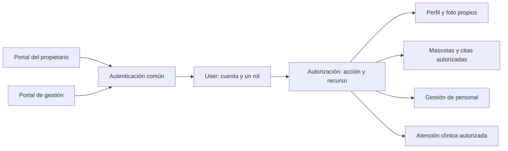

# GrownupsVet: usuarios, roles y foto de perfil

Fecha inicial: 6 de septiembre de 2026. Actualizado el 9 de septiembre con el login y la firma JWT. Base de diseño para registro, acceso y perfil. Se contrastaron el código local y las historias de Jira citadas aquí. El documento distingue la autenticación implementada de las operaciones de perfil y foto aún pendientes.

## Decisiones confirmadas y estado actual

- Esteban confirmó **un solo rol por cuenta** para la primera versión.
- El modelo existente `User` centraliza UUID, correo, hash de contraseña, rol y estado activo. `UserRole` y la migración `V1__create_users.sql` contienen `OWNER`, `VETERINARIAN` y `ADMINISTRATOR`.
- Las historias de Jira distribuyen las funciones entre propietario, veterinario y administrador. El registro público crea propietarios; no permite autoconcederse roles profesionales.
- El acceso común está implementado con credenciales de `User`, JWT RS256 de 24 horas y cuatro autoridades iniciales de perfil propio.
- La foto de perfil sí forma parte de la primera versión. Aportarla es opcional. Esteban prefiere almacenar las imágenes directamente en PostgreSQL por el carácter académico del sistema.
- El propietario puede modificar teléfono y foto. Los demás datos personales del registro no tienen edición por el propietario en esta versión. Cambio y recuperación de contraseña pertenecen a autenticación.

## Responsabilidades de los tres roles

| Rol | Responsabilidad prevista en el backlog | Límite de acceso |
|---|---|---|
| `OWNER` — Propietario | Su perfil, sus mascotas, solicitudes de cita y consulta de información clínica publicada de sus mascotas. | La autorización comprueba la propiedad del recurso. No puede acceder a perfiles o mascotas ajenos, administrar personal ni modificar información clínica. |
| `VETERINARIAN` — Veterinario | Atención autorizada, registros clínicos, fórmulas y controles asociados. | Debe existir autorización sobre la atención o historia concreta. El alcance de lectura de antecedentes y agenda se concretará con sus contratos. Este rol no administra cuentas o roles. |
| `ADMINISTRATOR` — Administrador | Habilitar/desactivar personal autorizado, gestionar disponibilidad y confirmar solicitudes de cita. | No puede modificar información clínica. Su acceso de lectura clínica todavía debe definirse; el nombre del rol no concede acceso ilimitado. |

Evidencia actual: [registro y perfil, SCRUM-6](https://uqvirtual-team-yavszk8l.atlassian.net/browse/SCRUM-6), [personal, SCRUM-10](https://uqvirtual-team-yavszk8l.atlassian.net/browse/SCRUM-10), [disponibilidad, SCRUM-11](https://uqvirtual-team-yavszk8l.atlassian.net/browse/SCRUM-11), [solicitud y confirmación, SCRUM-12](https://uqvirtual-team-yavszk8l.atlassian.net/browse/SCRUM-12), [atención clínica, SCRUM-14](https://uqvirtual-team-yavszk8l.atlassian.net/browse/SCRUM-14) y [fórmula, SCRUM-16](https://uqvirtual-team-yavszk8l.atlassian.net/browse/SCRUM-16). El alcance de consulta del propietario también se recoge en P10 del backlog general del proyecto.

Se mantienen estos tres roles y un catálogo de permisos fijo en código. El incremento de login incluye `PROFILE_READ_SELF`, `PROFILE_UPDATE_SELF`, `PROFILE_PHOTO_READ_SELF` y `PROFILE_PHOTO_UPDATE_SELF`; expresan intención y no sustituyen la futura comprobación de propiedad del recurso. Las tareas administrativas previstas ya incluyen disponibilidad y confirmación; el alcance revisado no exige añadir recepcionista, auxiliar ni superadministrador.

Los roles son responsabilidades independientes. No se propone una jerarquía que haga al administrador heredar las funciones clínicas del veterinario. La cuenta de mantenimiento que usa PostgreSQL es independiente del rol `ADMINISTRATOR` de la aplicación.

## Organización dentro del backend

Mantener una cuenta `User` compartida y un mecanismo común de autenticación para ambos portales. El rol se almacena como el enum actual. Tener tres roles no exige tres tablas de credenciales, tres mecanismos de login ni herencia Java entre tipos de usuario.

El backend implementa el [contrato de login y sesión](contrato-api-bases-propuestas.md#login-y-sesión-de-24-horas): JWT RS256 de 24 horas sin renovación, con identificación, correo, rol y permisos. Spring Security valida firma, emisor, audiencia y tiempo, y convierte `permissions` en autoridades. La revocación en PostgreSQL y la consulta del rol/estado vigente en cada petición todavía no están implementadas; por ello, un token ya emitido conserva su fotografía de permisos hasta expirar.

El diagrama describe la dirección propuesta; no significa que todos los roles puedan usar todas las operaciones. Spring Security comprueba acceso y los servicios aplican las reglas de cada recurso. Por ejemplo, ser `OWNER` permite solicitar la consulta de una mascota, pero también debe comprobarse que esa mascota pertenece a la cuenta autenticada. [Autorización de métodos en Spring Security](https://docs.spring.io/spring-security/reference/servlet/authorization/method-security.html).

Las peticiones de registro público y de edición de perfil no exponen `role` ni `active` como campos modificables. El servidor asigna `OWNER` en el registro público. La creación de personal es una operación administrativa distinta; el procedimiento para crear el primer administrador se definirá al preparar ese flujo.

Los perfiles de dominio pueden asociarse con `User` conforme se definan sus datos. La fecha de nacimiento y demás requisitos del registro del propietario no se convierten automáticamente en datos obligatorios para personal. Un perfil veterinario contendrá los datos profesionales que se acuerden al desarrollar esa historia. La foto puede asociarse a la cuenta sin duplicar el mecanismo de autenticación.

## Foto opcional almacenada en PostgreSQL

Para un volumen académico pequeño, se propone conservar las fotos en la misma base del proyecto. PostgreSQL ofrece `bytea` para almacenar bytes. Esto simplifica disponer de los datos y las fotos en la misma base; aumenta su tamaño y el de sus copias de seguridad. [Tipos binarios de PostgreSQL 18](https://www.postgresql.org/docs/18/datatype-binary.html).

Propuesta de persistencia: tabla `user_profile_photos`, con `user_id` como clave primaria y foránea a `users.id`, contenido `bytea`, tipo de imagen validado y fecha de actualización. Una cuenta puede tener cero o una fila: la ausencia de fila representa un perfil sin foto. Las consultas de cuenta y login no deben cargar el contenido de la imagen.

Propuesta de funcionamiento:

- Crear la cuenta sin exigir foto y permitir añadirla, sustituirla o eliminarla desde el perfil autenticado. Un error al subir la foto no debe impedir usar una cuenta ya creada.
- Enviar el archivo en una operación de carga separada y entregar los bytes de la imagen cuando se soliciten. Los DTOs habituales de usuario no incluyen la imagen codificada en Base64.
- Como límites iniciales para discutir: JPEG o PNG, máximo 2 MiB (2 097 152 bytes) y un límite explícito de dimensiones/píxeles antes de procesarla. Estos límites son decisiones de la aplicación, no restricciones de PostgreSQL.
- Validar el contenido real de la imagen, además del tamaño; no confiar solo en la extensión o en el tipo declarado por el cliente. La carga, lectura, sustitución y eliminación deben aplicar autorización sobre la cuenta correspondiente. [OWASP: carga de archivos](https://cheatsheetseries.owasp.org/cheatsheets/File_Upload_Cheat_Sheet.html).

La política inicial propuesta es permitir al propietario consultar y gestionar su foto; la lectura por otros actores se definirá solo si un recorrido del producto la necesita. El formato de carga, los límites definitivos y las respuestas se concretarán en OpenAPI. Este diseño no añade fotos de mascotas ni documentos clínicos.

### Propuesta concreta de tratamiento de fotos — 7 de septiembre

La preferencia de PostgreSQL se mantiene. La tabla separada permite obtener la cuenta sin arrastrar los bytes de su imagen y sustituir la foto sin modificar las credenciales. El coste práctico es que las fotos aumentan también el tamaño de las copias de seguridad de la base; para este volumen académico se propone limitar y reducir cada imagen antes de guardarla.

Propuesta de columnas: `user_id` (UUID, PK y FK), `content` (`bytea` con los bytes procesados), `content_type` (tipo real de salida), `size_bytes`, `width`, `height` y `updated_at`. Cero filas significa que la cuenta no tiene foto; una fila representa su foto actual. No se guarda una ruta local del computador del usuario ni el JWT ni el nombre original como identificador público.

Recorrido propuesto:

1. Crear y usar la cuenta sin foto. Desde el perfil, seleccionar un archivo; la interfaz muestra una vista previa y una opción clara de guardar o cancelar.
2. Enviar el archivo en una petición autenticada separada, con `multipart/form-data`. El teléfono viaja en la operación de edición de datos; la foto no se añade como Base64 al JSON de perfil o login.
3. Admitir inicialmente JPEG/PNG y hasta 2 MiB. Verificar tamaño de petición/archivo, firma, formato decodificable y dimensiones antes de reservar grandes cantidades de memoria. Propuesta adicional: hasta 8.000 píxeles por lado y 20 millones de píxeles en total; el límite de bytes no sustituye el de píxeles.
4. Corregir la orientación cuando corresponda, reducir proporcionalmente hasta un máximo de 512 píxeles por lado y volver a codificar sin conservar metadatos del original. No ampliar imágenes pequeñas ni deformarlas. La salida puede conservar JPEG o PNG según el formato admitido. El servidor vuelve a comprobar límites aunque el cliente reduzca la imagen para facilitar la carga.
5. Guardar o reemplazar la fila en una transacción. Un archivo inválido no elimina la foto anterior; un fallo al subir la foto no revierte una cuenta ya creada.
6. Entregar la imagen mediante lectura autenticada y tipo de contenido correcto. Si se utiliza Bearer en un cliente web, este solicita los bytes con su cliente HTTP y muestra el resultado como un objeto Blob local al navegador; no coloca el token en la URL. El almacenamiento de ese token depende del acuerdo con ambos frontends.
7. Permitir eliminar la foto propia. La interfaz vuelve a mostrar un avatar predeterminado; el borrado repetido debe tener un resultado consistente.

Estos límites y la reducción son recomendaciones del proyecto para revisar antes del contrato final. El máximo de 2 MiB puede rechazar fotos originales de algunos teléfonos; se propone que el frontend prepare una copia más pequeña y comunique cualquier rechazo sin exigir conocimientos de formatos al usuario. HEIC, SVG y animaciones no se prometen en este alcance inicial.

La validación del contenido, los límites de carga y la reescritura de imágenes se apoyan en [OWASP: carga de archivos](https://cheatsheetseries.owasp.org/cheatsheets/File_Upload_Cheat_Sheet.html). La reescritura es una medida adicional; no sustituye autorización ni límites de recursos. La protección de lectura requiere también una política de caché apropiada para una imagen privada.

Propuesta de resultados a fijar en OpenAPI: `413` si excede el tamaño de carga, `415` si el formato no está admitido, `400` para contenido inválido o dimensiones fuera de política, `401` sin sesión válida y `403` sin autorización. En el perfil puede exponerse un indicador como `hasProfilePhoto`; su nombre final, el resultado de consultar una foto inexistente y las rutas/métodos todavía deben fijarse en la especificación.

## Siguiente incremento

1. Revisar y publicar el contrato incremental de registro y login como evidencia de [SCRUM-67](https://uqvirtual-team-yavszk8l.atlassian.net/browse/SCRUM-67).
2. Definir las rutas y respuestas de consulta/edición del perfil y foto opcional, incluida la comprobación de propiedad; después implementar su persistencia con una nueva migración Flyway, sin modificar `V1` ni `V2`.
3. Verificar el recorrido en PostgreSQL de pruebas, incluidos perfil sin foto, imagen válida, rechazos pertinentes y denegación de acceso a recursos de otra cuenta.
4. Diseñar aparte la revocación/cierre de sesión y el comportamiento inmediato ante desactivación o cambio de rol. No se atribuye esa capacidad al JWT actual.

Antes de implementar autorización clínica se concretarán la relación que habilita al veterinario a consultar una historia y los datos clínicos que puede leer el administrador. Estas decisiones pertenecen a los contratos de personal y atención y no obligan a resolver ahora todos los módulos del sistema.
